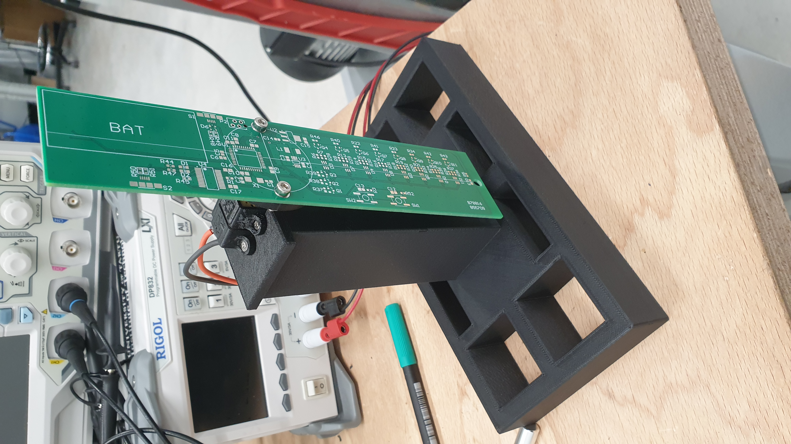
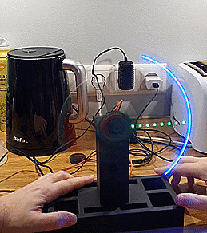
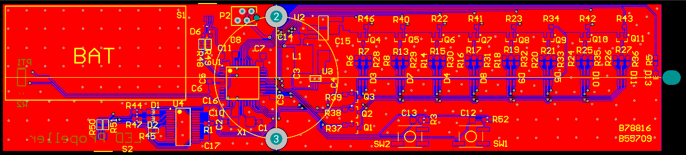
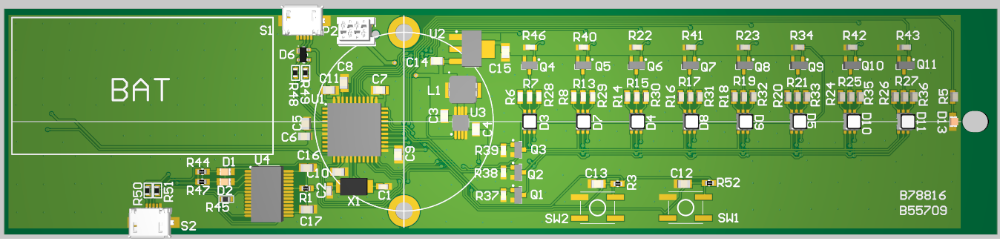

# Led Propeller
The propeller clock is a linear array of light emitting diodes, rotating at a high angular velocity to generate a circular screen. By synchronising these light emitting diodes, and keeping in mind the concepts of persistence of vision and limit of resolution, we can display a clock.

## Pictures

## Schematics

## Layout
The following figures visualize the front side of the PCB along with the 3D model of the design.

## PCB production files
Gerber files can be found in this [folder](https://github.com/markomuro/Led_Propeller/electronics/gerbers).